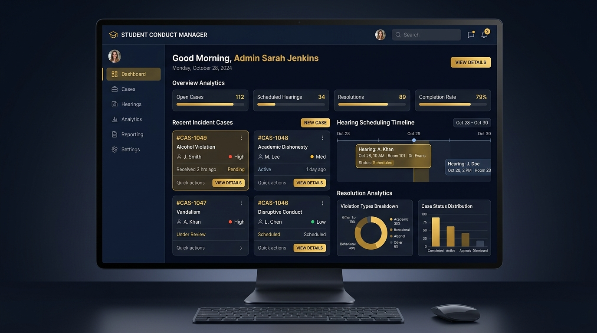

# Student Disciplinary Management System (SDMS) - User Manual



## 1. System Overview

The **Student Disciplinary Management System (SDMS)** is a comprehensive, digital governance platform designed for higher education institutions. Built with Flutter cross-platform architecture and powered by Supabase Cloud, SDMS ensures fair, transparent, and compliant handling of all student disciplinary matters.

### Core Objectives
* **Enforce Due Process:** Strictly sequence incident intake, notice, hearing, sanction, and appeal stages.
* **Gated Sanctions Rule:** Guarantee that no sanction can be levied without a prior scheduled and recorded hearing.
* **Role Isolation:** Provide dedicated interfaces tailored for Students, Disciplinary Staff/Committee Members, and System Administrators.
* **Real-time Synchronization:** Maintain a live multi-platform database for immediate notification updates.

---

## 2. System Architecture & Workflow Rules

SDMS enforces a **4-Step Sequential Lifecycle** across all cases:

```
[1. Incident Intake] ──► [2. Hearing Scheduling] ──► [3. Gated Sanction] ──► [4. Due Process Appeal]
```

1. **Incident Intake:** Confidential report created by student, staff, or campus security with category, location, and witness logs.
2. **Hearing Notice & Scheduling:** Staff assign committee officers, date/time, and venue. An automated notice is dispatched to the student portal.
3. **Gated Sanctions & Rulings:** The Sanction module remains **LOCKED** until a hearing date is scheduled and conducted. Upon hearing completion, committee rulings (probation, warning, suspension) are recorded.
4. **Appeals & Administrative Audit:** Students have a 14-day window to file an appeal. Administrators review new evidence or procedural appeals before closing the case file.

---

## 3. Role-Based User Manual

### 🎓 A. Student Portal Manual

#### 1. Signing In & Account Access
* Open the SDMS Portal app or website.
* Enter your institutional email address (e.g., `student@ueab.ac.ke`) and password.
* Select **Student** as your role on the sign-in screen.

#### 2. Viewing Your Dashboard & Case Progression Bar
* **Case Progression Bar:** Every active case on your student dashboard displays a visual 4-Stage Progress Tracker:
  * **Stage 1 (25% - Intake):** Incident report received and under officer investigation.
  * **Stage 2 (50% - Hearing Scheduled):** Hearing date and venue assigned. Sanction module remains strictly locked until hearing date.
  * **Stage 3 (75% - Ruling & Sanction):** Hearing completed and committee ruling recorded.
  * **Stage 4 (100% - Resolved & Closed):** Case finalized or appeal resolved.
* **Notifications Center:** Alerts you to any hearing notices, location updates, or committee decisions.

#### 3. Submitting an Incident Report & Photo / Video Evidence
1. Navigate to **Report Incident** in the top navigation bar.
2. Fill out the mandatory fields:
   * **Violation Category:** (e.g., Academic Dishonesty, Campus Noise/Disruption, Property Damage, Harassment).
   * **Date & Location of Incident.**
   * **Detailed Statement:** Provide an objective summary of the event.
3. **Where to Add Photos & Videos as Evidence:**
   * Under the **Attach Evidence (Photos & Videos)** section, click **Add Photo** or **Add Video**.
   * Upload or attach image files (`JPEG`, `PNG`, `WEBP`) or video recordings (`MP4`, `MOV`, `AVI`).
   * Add optional caption notes or file descriptions.
   * Preview photos and play attached video clips directly in the evidence list.
4. Click **Submit Confidential Report**. A unique Case Reference (e.g., `SDMS-2026-089`) will be generated.

#### 4. Attending Hearings & Reviewing Rulings
* Under **My Cases**, select your case reference to view the assigned venue, committee chair, and hearing agenda.
* Post-hearing, review the formal ruling notice, including any required rehabilitation or disciplinary terms.

#### 5. Submitting an Appeal with Photo/Video Evidence
1. Open a case marked with a ruling.
2. Click **Submit Appeal**.
3. Select your appeal grounds (*New Material Evidence*, *Procedural Flaw*, or *Excessive Sanction*).
4. **Attach Supporting Evidence:** Click **Add Photo** or **Add Video** under Evidence Attachments to upload new proof (medical certificates, video statements, photo receipts).
5. Click **File Appeal to VC Board**. Track the status and appeal progress directly on your dashboard progress bar.

---

### 🛡️ B. Staff & Disciplinary Committee Manual

#### 1. Managing Case Intake
* Access the **Staff Dashboard** to see all incoming reports.
* Filter cases by **Status** (*Pending Intake*, *Hearing Scheduled*, *Awaiting Sanction*) or **Priority**.

#### 2. Scheduling a Disciplinary Hearing
1. Select an intake case and click **Schedule Hearing**.
2. Set the **Hearing Date**, **Time**, and **Venue** (e.g., *Dean's Office Boardroom*).
3. Assign **Committee Members** and set the official hearing agenda.
4. Click **Issue Hearing Notice**. The status updates to `Hearing Scheduled` and unlocks the hearing timeline.

#### 3. Recording Gated Sanctions
* **Rule Enforcement:** The Sanction Form is grayed out and locked if no hearing has been set.
* After conducting the hearing:
  1. Open the case and select **Record Hearing Outcome & Sanction**.
  2. Choose the appropriate sanction tier:
     * *Formal Written Warning*
     * *Disciplinary Probation*
     * *Community Service / Restitution*
     * *Temporary Academic Suspension*
  3. Enter the committee findings and effective start/end dates.
  4. Click **Publish Sanction**.

---

### 🏛️ C. Administrator Portal Manual

#### 1. System-Wide Analytics & Governance
* Access the **Admin Dashboard** to view high-level metrics: Total Cases, Average Case Processing Time, Appeals Rate, and Sanction Distribution.

#### 2. Reviewing Student Appeals
1. Navigate to **Appeals Board Review**.
2. Select a student appeal to view the original incident report, hearing transcript, sanction imposed, and student's appeal justification.
3. Render an administrative verdict:
   * **Uphold Ruling:** Confirm original committee decision.
   * **Modify Sanction:** Adjust sanction severity or probation duration.
   * **Overrule & Dismiss:** Quash the sanction due to procedural irregularity or new exonerating evidence.

#### 3. Audit Logs & System Administration
* Export complete CSV/PDF audit trails for institutional compliance audits.
* Manage user role permissions and committee assignments.

---

## 4. Frequently Asked Questions & Troubleshooting

| Question / Issue | Solution |
| :--- | :--- |
| **Why is the Sanction button disabled for Staff?** | SDMS enforces the *Gated Sanction Rule*. You must schedule and conduct a formal hearing first before sanctions can be logged. |
| **How long does a student have to submit an appeal?** | Students have 14 calendar days from the date of sanction publication to file an appeal through the portal. |
| **Can an incident report be deleted?** | To ensure transparency, incident records cannot be deleted. Case files can only be closed or dismissed by an Administrator. |
| **How do I reset my password?** | Click **Forgot Password** on the login screen or contact your institution's SDMS System Administrator. |
